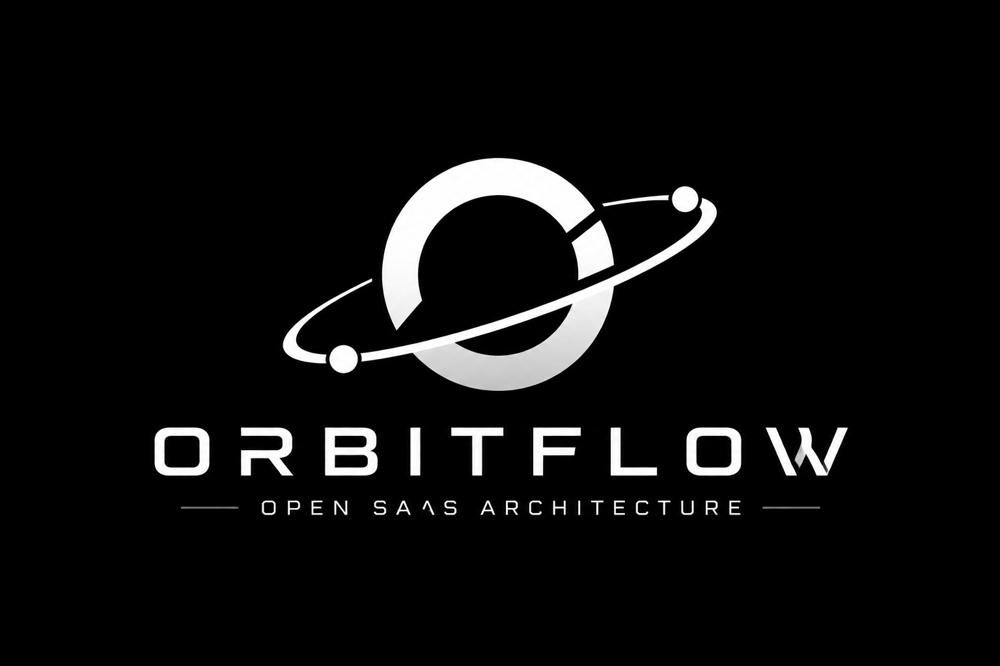

<div align="center">



# OrbitFlow

**Open-source SaaS foundation for scalable web platforms**

[](https://www.typescriptlang.org/)
[](https://nestjs.com/)
[](https://www.prisma.io/)
[](https://www.postgresql.org/)
[](https://redis.io/)
[](https://turbo.build/)
[](#license)

[API Reference](./docs/API_REFERENCE.md) | [Frontend Guide](./docs/FRONTEND_GUIDE.md) | [Specs](./docs/specs/README.md) | [Architecture](./docs/ai/ARCHITECTURE.md) | [Security](./SECURITY.md)

</div>

---

## What Is OrbitFlow?

OrbitFlow is a multi-tenant SaaS foundation designed to help developers build organized, secure, and scalable web platforms without starting from zero.

The included reference domain is a feedback board platform, similar in spirit to Canny, Nolt, or ProductBoard. The deeper goal, however, is broader: this repository can be adapted into a CRM SaaS, finance SaaS, workflow platform, internal tool, community product, or any other multi-tenant application that needs a professional backend and infrastructure baseline.

The project focuses on the parts that often make SaaS projects stall when they start growing: authentication, tenant isolation, authorization, API structure, validation, documentation, infrastructure, CI, and clear engineering rules.

## Author's Note

This project was created as part of my studies and practical evolution in **Software Engineering and Systems Architecture**.

It reflects the way I like to design software: clear boundaries, security by default, organized infrastructure, documentation that helps both humans and AI tools, and a structure that can grow beyond a simple MVP.

This is also an honest open-source portfolio project. It may contain mistakes, incomplete decisions, or areas that can be improved. Contributions, feedback, reviews, and suggestions are welcome.

I intentionally organized the repository to support **AI-assisted development**. The `docs/ai` folder contains context, architecture decisions, coding standards, security rules, and product guidance so AI tools can help implement features while following the project's engineering direction. In this workflow, I orchestrate the architecture, requirements, review, and decisions; AI is used as an implementation assistant.

The project also includes `docs/specs`, a set of living behavior specs that guide humans and AI tools before code is written. The specs are connected to a small test harness so critical contracts can be reviewed and validated instead of relying only on generated code.

The intention is simple: give builders a safer and more organized foundation for SaaS and web platforms, so they can focus on their product, frontend, users, and business logic.

## Who This Is For

- Developers who want a professional SaaS starting point.
- Founders validating a web platform without ignoring architecture.
- Students and engineers studying scalable backend organization.
- Builders using AI tools to generate frontend or product modules on top of a reliable API.
- Teams that want a modular monolith before deciding if microservices are really necessary.

## What You Can Build With It

OrbitFlow can be adapted for many SaaS categories:

- CRM platforms
- Finance dashboards
- Feedback boards
- Client portals
- Internal admin tools
- Subscription products
- Workflow and task systems
- Community or interaction platforms

The idea is to keep the core structure stable and replace or extend the domain modules.

## Core Features

- **Multi-tenant workspaces** - workspace-scoped data model and access checks.
- **Authentication** - JWT access tokens and Redis-backed refresh token rotation.
- **Authorization** - workspace roles with `OWNER`, `ADMIN`, `MEMBER`, and `VIEWER`.
- **Secure by default routes** - API routes require JWT unless explicitly marked with `@Public()`.
- **Repository pattern** - controllers, services, and repositories have clear responsibilities.
- **Validation** - DTO validation with `class-validator` and strict global validation pipes.
- **Response envelope** - consistent `{ data, meta }` success responses.
- **Error envelope** - consistent error payloads through a global exception filter.
- **Rate limiting** - global request throttling with multiple time windows.
- **Audit log** - event listener persists important auth, workspace, board, post, vote, and comment actions.
- **Documentation for AI and humans** - architecture, product context, coding standards, and security rules.
- **Spec-guided workflow** - living specs for auth, tenant access, API envelopes, frontend integration, and AI-assisted work.
- **Test harness** - unit-test helpers for mocks, transactions, and API response contracts.
- **Docker infrastructure** - PostgreSQL, Redis, API, and NGINX API gateway setup.
- **Frontend freedom** - no required frontend implementation; bring Next.js, React, Vue, mobile, or any client.
- **CI pipeline** - lint, typecheck, tests, build, and Docker image validation.

## Architecture

```text
willtech-orbitflow/
|-- apps/
|   |-- api/                    # NestJS backend
|   |   |-- src/
|   |   |   |-- common/         # Guards, filters, interceptors, decorators, authorization
|   |   |   |-- config/         # Environment configuration and validation
|   |   |   |-- modules/        # Auth, users, workspaces, boards, posts, votes, comments, health
|   |   |   |-- prisma/         # Database lifecycle
|   |   |   `-- redis/          # Redis connection and helpers
|   |   `-- prisma/
|   |       `-- schema.prisma   # Multi-tenant database schema
|-- packages/
|   |-- eslint-config/          # Shared lint rules
|   `-- tsconfig/               # Shared TypeScript configs
|
|-- docs/
|   |-- ai/                     # AI-assisted development context
|   |-- specs/                  # Living behavior specs for humans and AI
|   |-- API_REFERENCE.md
|   |-- FRONTEND_GUIDE.md       # How to add your own frontend
|   |-- TESTING_STRATEGY.md
|   `-- frontend/
|       `-- ADD_FRONTEND.md     # Frontend integration guide
|
|-- infrastructure/             # Docker and NGINX configs
`-- .github/workflows/ci.yml
```

## Design Patterns

| Pattern              | Implementation                                     |
| -------------------- | -------------------------------------------------- |
| Modular monolith     | Feature modules with clear boundaries              |
| Repository pattern   | `Controller -> Service -> Repository`              |
| Tenant authorization | Centralized workspace access checks                |
| Secure by default    | Global JWT guard with explicit `@Public()` opt-out |
| Workspace RBAC       | Workspace-scoped roles enforced by service checks  |
| Response envelope    | `{ data, meta }`                                   |
| Error envelope       | `{ error: { code, statusCode, message } }`         |
| Event-driven hooks   | Domain events for audit and future async workflows |
| Spec-guided workflow | `docs/specs` plus focused automated tests          |

## Tech Stack

| Layer         | Technology            |
| ------------- | --------------------- |
| Runtime       | Node.js 20+           |
| Language      | TypeScript            |
| Backend       | NestJS                |
| Frontend      | Bring your own client |
| Database      | PostgreSQL            |
| ORM           | Prisma                |
| Cache/session | Redis                 |
| Auth          | Passport + JWT        |
| Validation    | class-validator + Joi |
| Monorepo      | pnpm + Turborepo      |
| Containers    | Docker + Compose      |

## Getting Started

### Prerequisites

- Node.js >= 20
- pnpm >= 9
- PostgreSQL
- Redis

### Setup

```bash
git clone https://github.com/AlwaysPalaye/orbitflow.git
cd orbitflow

pnpm install

cp .env.example apps/api/.env
# Edit apps/api/.env with your local database, Redis, and JWT values.

cd apps/api
pnpm exec prisma generate
pnpm exec prisma db push
pnpm exec prisma db seed

cd ../../
pnpm dev
```

The default development command starts the backend packages in the workspace. Add your own frontend when your product needs one.

### Useful Commands

```bash
pnpm lint
pnpm typecheck
pnpm test
pnpm test:ci
pnpm build
pnpm format:check
```

### Docker

```bash
pnpm docker:up
pnpm docker:logs
pnpm docker:down
```

## AI-Assisted Development

This repository includes AI-readable engineering context in `docs/ai` and behavior specs in `docs/specs`:

- `AI_CONTEXT.md` - general guidance for AI tools.
- `ARCHITECTURE.md` - system architecture and design decisions.
- `CODING_STANDARDS.md` - code quality expectations.
- `ENGINEERING_RULES.md` - implementation rules and constraints.
- `PRODUCT_CONTEXT.md` - product direction and domain context.
- `SECURITY_RULES.md` - security baseline and expectations.
- `FRONTEND_APP_PROMPT.md` - prompt for adding a frontend with AI assistance.
- `HOW_TO_INSTRUCT_AI.md` - guidance for giving better instructions to AI tools.
- `../specs` - contracts the AI should read before changing behavior.

The goal is to make AI assistance more reliable by giving it structure, constraints, and project-specific context instead of asking it to improvise everything from scratch.

## Specs And Testing

OrbitFlow follows a spec-guided workflow inspired by Spec-Driven Development. The specs document the intended behavior; the test harness validates critical contracts such as auth, workspace access, vote transactions, audit listeners, and API envelope formatting.

The current suite uses unit tests and lightweight HTTP contract tests with mocked infrastructure. This keeps the project easy to run without requiring a local frontend, PostgreSQL, Redis, or a real `.env` just to validate the core contracts.

See:

- [Specs](./docs/specs/README.md)
- [Testing Strategy](./docs/TESTING_STRATEGY.md)

## Current Status

This project is ready for public review as an open-source portfolio project and SaaS foundation. Before publishing, rotate any secrets that may have existed locally and make sure only `.env.example` is committed.

It is not presented as a perfect or finished framework. It is a strong starting point that should continue evolving with community review, tests, dependency upgrades, and real production feedback.

Before using it in production, review:

- environment secrets;
- dependency audit results;
- NestJS security updates and framework version upgrades;
- database migration history;
- test coverage for the reference domain modules;
- authorization rules for your domain;
- frontend architecture and deployment strategy;
- billing and subscription flows;
- audit log query/export needs for your product;
- backup and deployment strategy;
- frontend-specific security requirements.

## Production Hardening Backlog

These are intentionally documented instead of hidden. OrbitFlow is a foundation, not a claim that every production concern is already solved:

- Add Prisma migration history under `apps/api/prisma/migrations`.
- Upgrade NestJS when ready to remove the remaining moderate `@nestjs/core` audit advisory.
- Expand tests for boards, posts, comments, users, health checks, guards, and controllers.
- Add logout, password reset, email verification, workspace invites, and member management.
- Store refresh tokens as hashes if your threat model requires protection against Redis token disclosure.
- Add audit log query/export endpoints and decide retention rules per product.
- Add production deployment guides with TLS, backups, observability, and incident response notes.

## Roadmap

- [x] Monorepo setup with Turborepo and pnpm
- [x] Shared TypeScript and ESLint configs
- [x] NestJS modular architecture
- [x] Multi-tenant workspace model
- [x] JWT authentication with refresh token rotation
- [x] Workspace authorization service
- [x] Workspace RBAC authorization baseline
- [x] Feedback domain reference implementation
- [x] Docker infrastructure
- [x] CI pipeline
- [x] Frontend integration documentation
- [x] AI-assisted development documentation
- [x] Spec-guided documentation
- [x] Unit test harness for critical backend contracts
- [x] Audit log event listeners
- [ ] Frontend integration recipes
- [ ] Stripe billing integration
- [ ] Email notification service
- [ ] File storage with S3/R2
- [ ] Audit log query endpoints and export workflow
- [ ] WebSocket real-time notifications
- [ ] Observability and metrics module
- [ ] More integration and e2e tests
- [ ] Production deployment examples

## Contributing

Contributions are welcome.

You can help by opening issues, suggesting architecture improvements, improving documentation, adding tests, reviewing security decisions, or adapting the base to new SaaS use cases.

Please read [CONTRIBUTING.md](./CONTRIBUTING.md) before submitting pull requests.

## License

MIT - Will Tech Engineering (c) 2026

---

<div align="center">
  <sub>Engineered with intention. Open for builders.</sub>
</div>
